# Projects

Welcome to my portfolio of selected research and engineering projects. My work spans machine learning applications, deep learning optimization, time-series analysis, signal processing, and real-world diagnostics in high-voltage systems and mechanical components. Below you'll find detailed descriptions of my key contributions, including methodologies, visuals, and links to related publications.

---

## ⏱️ Multiscale Time-Series Feature Extraction Using Entropic & Informational Functionals

This project proposes a general-purpose methodology to transform time series into interpretable sequences of **entropic and information-theoretic features**. The method is designed for **anomaly detection** and **time-series characterization** in domains such as fault monitoring, EEG seizure detection, and more.

The approach combines:
- **Multiscale overlapping windows**
- **Non-parametric Kernel Density Estimation (KDE)**
- **Adaptive bandwidth optimization using Jensen–Shannon Divergence (JSD)**
- **A library of continuous entropic and informational measures** (e.g., Shannon, Tsallis, Rényi, Fisher Information)

---

### 🧠 Why This Matters

Entropy and information measures provide a **rich, continuous description of signal complexity**, uncertainty, and structure — essential for detecting subtle or time-localized anomalies. Our method optimizes the transformation parameters and builds a **scale-adaptive, windowed representation** of the signal.

---

### 📐 Method Overview

The methodology applies **KDE** to windowed segments of the time series at multiple scales, producing a sequence of PDFs. Then, various **entropy-based features** are computed for each PDF. The bandwidth is optimized offline using **JSD**, ensuring minimal bias and variance.

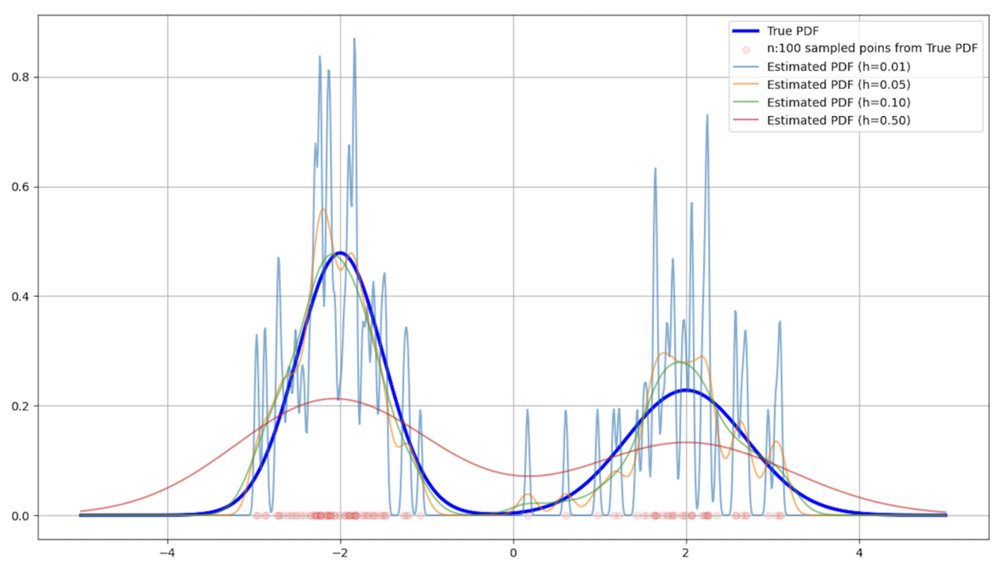  
*A modular pipeline applying KDE, JSD-based optimization, and entropic feature extraction over multiscale overlapping windows.*

---

### 🔬 Experimental Results

#### 🧪 Synthetic Signal with Contextual Anomaly

We generate a synthetic signal that transitions from a normal to an anomalous regime using added frequency components. The anomaly is detected by shifts in entropy and information content.

  
*A designed synthetic signal where harmonic content shifts during the anomaly window.*

#### 🎯 Multiscale Feature Plots

We visualize the extracted features across different window sizes and time indices.

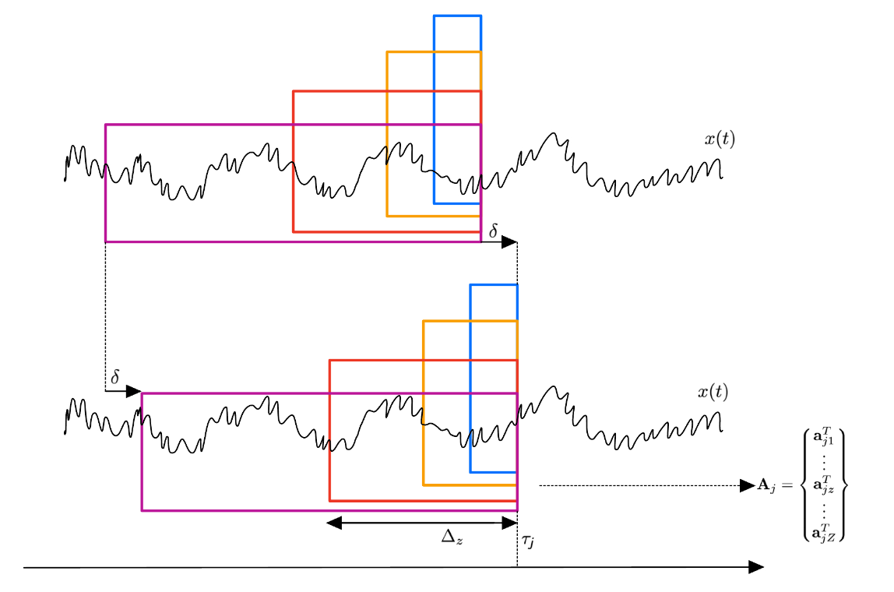  
*Multiscale entropy and Fisher information curves over time. Anomalies manifest as sudden drops in information and spikes in entropy.*

---

### 🧠 Real Application: EEG Seizure Detection

The methodology was applied to **scalp EEG signals** from the CHB-MIT database. The results show that seizures trigger consistent, multi-scale changes in the extracted features.

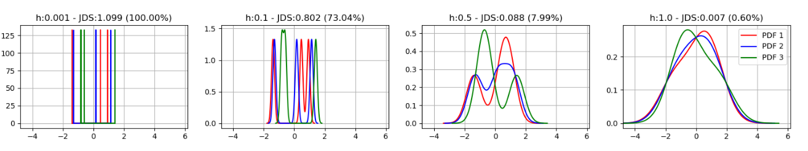  
*EEG signal before seizure: healthy baseline.*

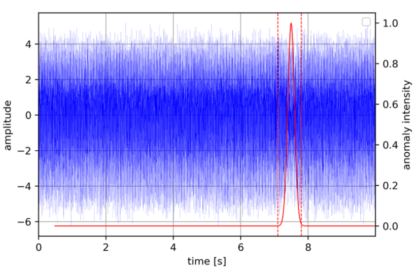  
*Entropy and information functionals capturing the seizure onset across scales.*

---

### 📈 Final Validation

To ensure interpretability, we also plotted the PDFs generated at different scales and bandwidths to visualize how KDE transforms signal windows before entropy evaluation.

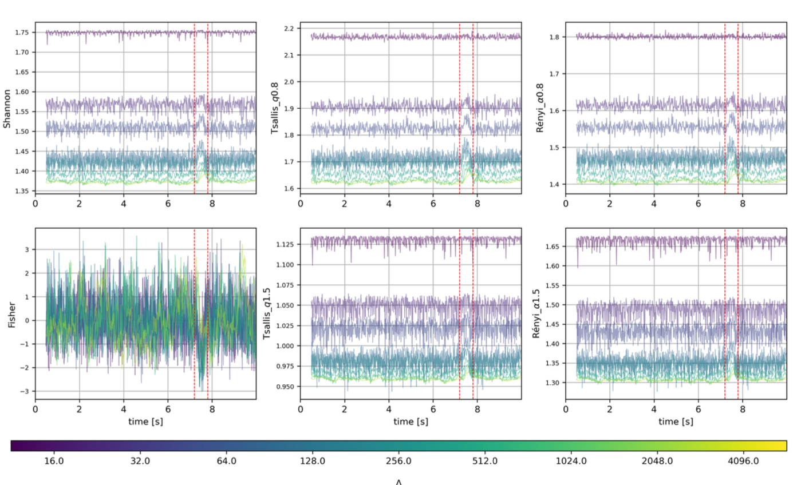  
*Grid of PDFs for anomaly and normal signals across scales and bandwidths, showing clear contrast.*

---

### 📄 Related Publication

**Squicciarini, A., Valero Toranzo, E., Zarzo, A.**  
*A Time-Series Feature-Extraction Methodology Based on Multiscale Overlapping Windows, Adaptive KDE, and Continuous Entropic and Information Functionals*,  
Mathematics, vol. 12, 2396, 2024.  
📎 [https://doi.org/10.3390/math12152396](https://doi.org/10.3390/math12152396)  
🔬 [Project Code on GitHub](https://github.com/antosquicciarini/Information_Measurement)

---

## 📉 Jensen-Tsallis Divergence for Supervised Classification under Data Imbalance

In many real-world classification problems—such as in healthcare, fraud detection, or predictive maintenance—data imbalance is a major challenge. Conventional loss functions like **Categorical Cross Entropy (CE)** can lead to models that overfit to majority classes and produce **overconfident predictions** that fail to generalize.

In this work, we propose the **Jensen-Tsallis Divergence (JTD)** as a **new loss function** for deep learning models trained on imbalanced datasets. It generalizes the well-known **Jensen-Shannon Divergence (JSD)** by incorporating **Tsallis entropy**, introducing a tunable parameter `q` that directly influences regularization strength.

---

### 🧠 Why Jensen-Tsallis?

- **Built-in regularization**: JTD discourages overconfident output distributions, leading to better generalization.
- **Tunable flexibility**: The `q` parameter controls how strongly the model penalizes high-confidence predictions.
- **Superior performance**: JTD consistently outperforms CE, JSD, and focal loss in tests with artificially imbalanced datasets (MNIST, CIFAR-10, SVHN, Fashion-MNIST).

---

### 🔍 Theoretical Insight

We demonstrate that JTD introduces an intrinsic **confidence penalty** on output predictions. By adjusting `q`, we control how conservative the model becomes, thus reducing overfitting.

---

### 🔬 Results: Accuracy & Regularization Effect

#### 🔄 Learning Curve Comparison

  
*Test vs train accuracy using CE, JSD, and JTD with various `q`. JTD improves generalization without overfitting.*

#### 🎯 Regularization Term Behavior

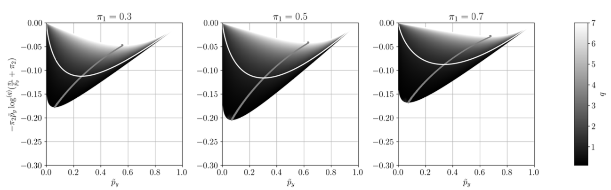  
*Behavior of the JTD's regularization term as a function of model confidence. Larger `q` values shift the regularization curve and enhance robustness.*

---

### 📄 Related Preprint

**Squicciarini, A., Trigano, T., Luengo, D.**  
*Jensen-Tsallis Divergence for Supervised Classification under Data Imbalance*, submitted to Springer - Machine Learning (ECLM 2025).  
🔗 [Project Repository](https://github.com/antosquicciarini/Jensen_Tsallis_Divergence_for_Supervised_Classification_under_Data_Imbalance)

---

## 🔧 Rub Detection in Aeroderivative Gas Turbines

**Rotor–stator rub** is a common but critical malfunction in turbomachinery, particularly in aero-derivative gas turbines where design constraints limit sensor placement. Due to compact geometries and the use of ball bearings instead of hydrodynamic ones, **proximity sensors are impractical**, and vibration must be monitored indirectly via **accelerometers on the casing**.

These signals are affected by high levels of noise, making **rub detection in early stages difficult** with traditional frequency-domain techniques such as Fourier analysis.

---

### 🧠 Our Deep Learning-Based Solution

In our work, we present a novel **Intelligent Fault Detection (IFD)** system using **deep neural networks (DNNs)** trained with **synthetic vibration data** from a calibrated **finite element (FE) model** of a rotating machine.

This data-driven approach avoids the need to collect dangerous real-world fault data and opens the door to safe, scalable training of deep models. The key features of our methodology include:

- **Synthetic Dataset Creation**: An FE model simulates rub events of varying intensity and frequency (e.g., light rub: 1×; heavy rub: ½×).
- **Transfer Learning**: The DNN trained on simulated data generalizes well to **real experimental signals**, achieving up to **91% G-Mean** and **~86% accuracy**.
- **Data Preprocessing**: Accelerometer signals are resampled, windowed, and transformed via **FFT** to emphasize relevant harmonic content.
- **Regularization & Optimization**: Grid search was used to identify optimal architectures with **L1/L2 regularization**, improving generalization.

---

### 🖼️ Simulation and Experimental Setup

#### 🧩 Finite Element Model Simulation
Here are two visualizations from the FE model used to generate synthetic training data for rub scenarios:

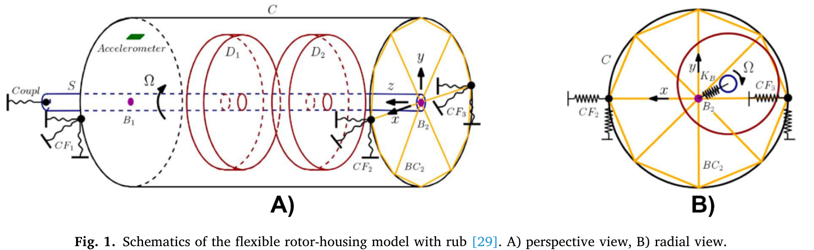  
*Finite Element model simulating single-point rub in high-speed shaft.*

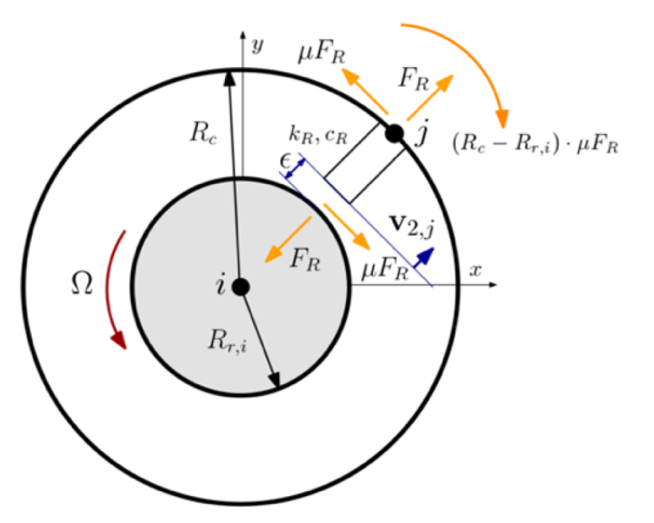  
*FE mesh used to simulate both light and heavy rub events.*

#### 🧪 Real Experimental Setup

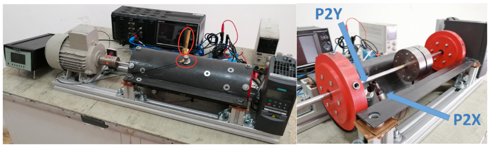  
*Experimental test bench with mounted accelerometers and proximity sensors used to validate model predictions.*

---

### 📊 Results and Transfer Learning Performance

We tested multiple DNN architectures with different regularization techniques (L1, L2, ElasticNet) to study how they affect generalization from synthetic to real-world signals.

#### 📋 Result Summary

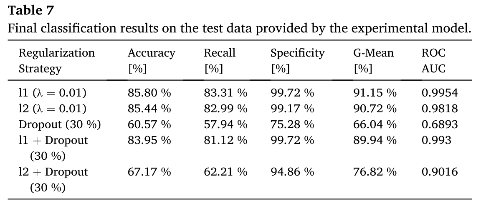  
*Performance of different DNN models on real test signals after training on synthetic data.*

#### 📈 AUC/ROC Curves Comparison

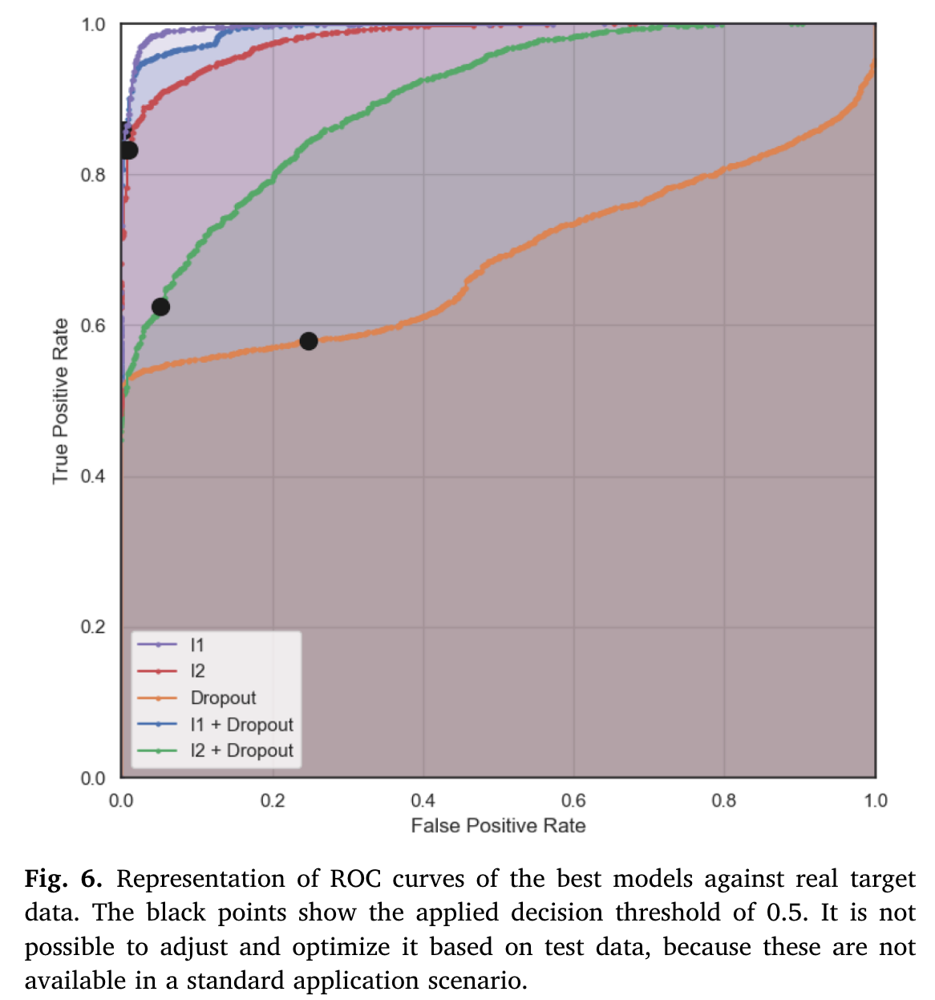  
*Comparison of AUC-ROC performance across models with varying regularization. Shows impact of regularization on robustness and transfer learning accuracy.*

---

### 📄 Related Publication

**Squicciarini, A., Zarzo, A., González-Guillén, C.E., Muñoz-Guijosa, J.M.**  
*Application of Deep Neural Networks for Automatic Rub Detection in Aero-Derivative Gas Turbines*,  
Advanced Engineering Informatics, vol. 62, 2024, Art. no. 102607.  
📎 [DOI: 10.1016/j.aei.2024.102607](https://doi.org/10.1016/j.aei.2024.102607)

---

## ⚡ [Partial Discharge Detection](projects/pd_classifications)
We developed a partial discharge classification system for high-voltage DC environments using deep learning, combining PRPD-inspired preprocessing, phase-robust data augmentation, and model interpretability through Integrated Gradients.

---

[🔙 Back to Home](./)
