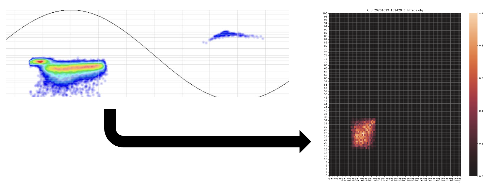
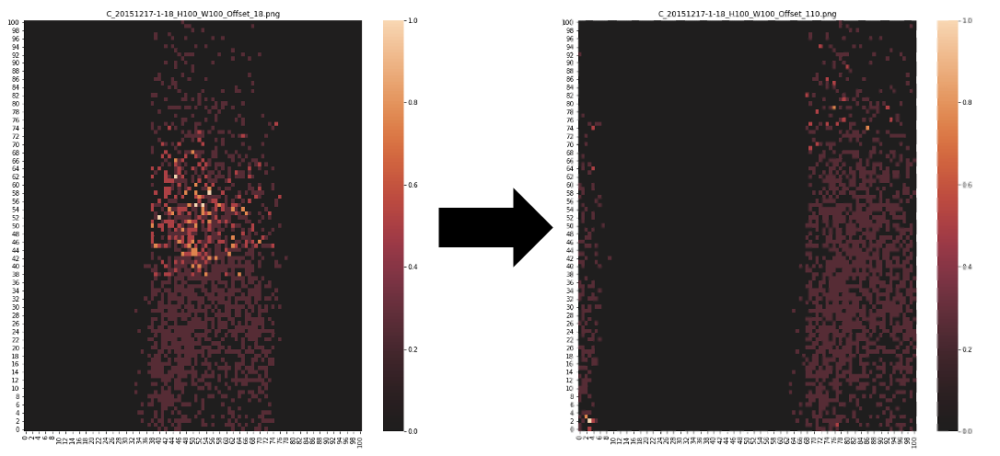
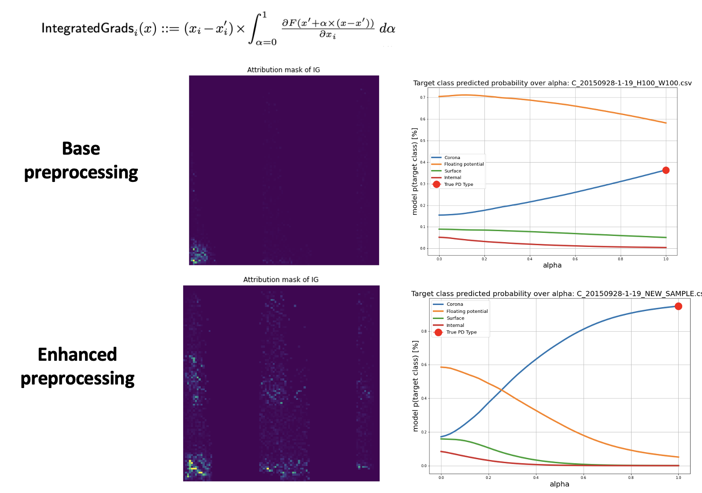

# Projects

## ⚡ Partial Discharge Detection

**Partial discharges (PD)** are localized electrical discharges that occur within insulation systems of high-voltage equipment, without completely bridging the electrodes. These discharges are early indicators of insulation degradation and can lead to failure if not identified and managed early.

PD detection is essential in **AC systems**, but with the growing development of **high-voltage DC (HVDC) transmission**, their identification in **DC environments** is becoming increasingly critical. HVDC is playing a pivotal role in long-distance power transmission and renewable energy integration, making PD monitoring under DC stress fundamental for system reliability.

---

### 🧬 Types of Partial Discharges

Partial discharges can manifest in different forms, depending on the location and mechanism of the discharge. Understanding these types helps in better diagnosis and classification:

- **Corona Discharge**: Occurs in gaseous media, typically around sharp edges or points where the electric field is highly concentrated. It is often accompanied by audible noise and ozone production.
- **Void Discharge**: Takes place within internal air-filled voids in solid insulating materials. These are dangerous over time as they can erode the insulation from the inside.
- **Surface (Superficial) Discharge**: Happens along the surface of insulating materials, especially in contaminated or moist environments. It can lead to tracking and eventual breakdown.
- **Floating Potential Discharge**: Arises from conductive elements embedded in the insulation that are not at a fixed electrical potential. These can oscillate and trigger discharges as the electric field fluctuates.

---

### ❓ Why Classifying PD Types Matters

Correctly **identifying the type of partial discharge** is crucial because each type is associated with different failure mechanisms, risk levels, and preventive actions:

- **Diagnostic Insight**: Each PD type reveals specific faults—voids suggest material degradation, while surface discharges may indicate environmental contamination.
- **Targeted Maintenance**: Accurate classification enables **predictive maintenance**, reducing downtime and extending equipment lifespan.
- **Risk Assessment**: Some PD types, like void discharges, may escalate more rapidly into full breakdowns than others like corona. Recognizing this allows for **prioritization of interventions**.
- **Data-Driven Design**: Understanding the most common PD types in specific environments helps engineers design more **robust insulation systems**.

In short, classification is not just a labeling exercise — it’s a **strategic tool** for electrical asset management and grid resilience.

---

### 🧪 Our Project

In our project, we tackled the challenge of PD classification in DC systems by leveraging deep learning techniques with an emphasis on data representation and interpretability.

#### 📊 1. Preprocessing Inspired by PRPD Maps

We developed a data preprocessing technique inspired by **Phase-Resolved Partial Discharge (PRPD)** representations. Although PRPD maps are traditionally used in AC systems, we adapted them for input into **Convolutional Neural Networks (CNNs)**, enabling the use of computer vision methods for PD classification.

> 📌 *Note: The PRPD-based approach for AC PD classification is currently under development.*

#### 🧩 2. Data Augmentation for Phase Robustness

To increase robustness against shifts in the discharge phase and enhance generalization, we implemented a **data augmentation strategy** that simulates phase variation. This ensures that the model does not overfit to specific phase alignments.

#### 🧠 3. Model Interpretability with Integrated Gradients

We used **Integrated Gradients**, a method for explainable AI (XAI), to visualize the contributions of each input feature to the CNN's decision. This allowed us to evaluate the effectiveness of our preprocessing and identify areas for improvement.

---

### 🔁 Classification Flowchart for PD in DC Systems

Finally, we designed a full classification pipeline tailored to partial discharges under DC stress. The system incorporates signal acquisition, preprocessing, CNN-based classification, and interpretability feedback.

> 📝 *The results of this work applied to HVDC PD classification are published in:*  
> **[1]** C. Vera et al., “Validation of a Qualification Procedure Applied to the Verification of Partial Discharge Analysers Used for HVDC or HVAC Networks,” *Applied Sciences*, vol. 13, no. 14, Art. no. 8214, 2023.  
> [https://doi.org/10.3390/app13148214](https://doi.org/10.3390/app13148214)

---

### 📚 References

1. IEC 60270 – High-voltage test techniques – Partial discharge measurements.  
2. M. Cavallini & G.C. Montanari, *IEEE Trans. Dielectrics and Electrical Insulation*, 2005.  
3. R. Albarracín et al., *IEEE Electrical Insulation Magazine*, 2019.  
4. M. Sundararajan et al., “Axiomatic Attribution for Deep Networks,” *ICML 2017*.  
5. C. Vera et al., *Applied Sciences*, vol. 13, no. 14, 2023. [DOI](https://doi.org/10.3390/app13148214)

---

[🔙 Back to Home](./)

## 🔬 Research Experience

**SIAM MDS22** — Poster: *Training Neural Networks with Synthetic Data* (USA, 2022)  
**CIBIM2022** — Paper: *Rub Detection in Gas Turbines with Deep Learning* (Madrid, 2022)  
**CEM Workshop** — Poster: *Validation of Calibration Procedures for HVDC PD Analyzers* (2023)  
**FDA & Nonparametric Stats Workshop** — Seminar: *EEG Seizure Analysis with KDE & Info Metrics*  
**IX Iberian Modelling Week** — Project: *Cryoablation Tumor Segmentation Algorithm*  
**BYMAD Conference** — Presentation: *EEG Seizure Description via Entropic Metrics*  
**III Junior Interdisciplinary Workshop** — Talk: *Time Signal Anomaly Detection Using KDE*

---

## 📚 Publications

- *Application of Deep Neural Networks for Automatic Rub Detection in Gas Turbines*  
  _Advanced Engineering Informatics_ (2024)

- *Validation of a Qualification Procedure for PD Analyzers*  
  _Applied Sciences_ (2023)

- *Jensen-Tsallis Divergence for Supervised Classification under Data Imbalance*  
  _(Submitted – NeurIPS 2024)_

- *Feature Extraction in Time Series with KDE & Entropic Functionals*  
  _(Under Review – MDPI Mathematics, 2024)_

---

## 💼 Work Experience

**Postgraduate Researcher**  
Universidad Politécnica de Madrid (2020 – 2022)  
- Developed supervised algorithms for partial discharge classification in HV networks.

---

## 🛠 University Projects

- **ERASMUS+ Programme**, UPM (2019–2020)  
- **PoliTo Sailing Team**, Dynamic Division (2018–2019)  
- **SEI - Explorer Module**, Fondazione Agnelli (2018)  
- **Percorso per Giovani Talenti**, Politecnico di Torino (2015–2018)

---

[🔙 Back to Home](./)
