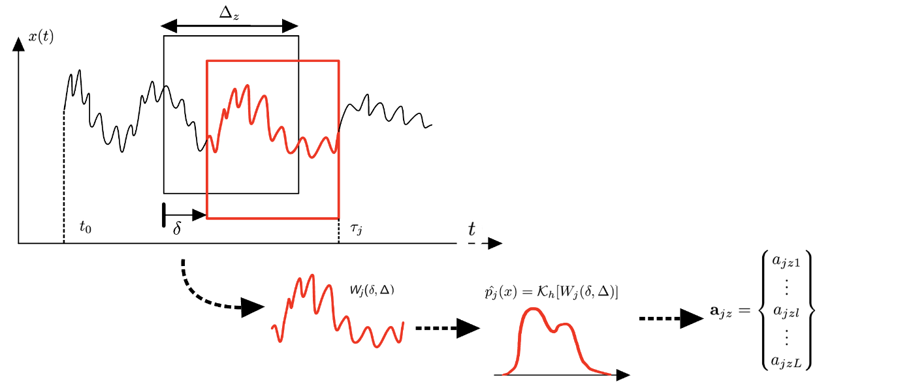
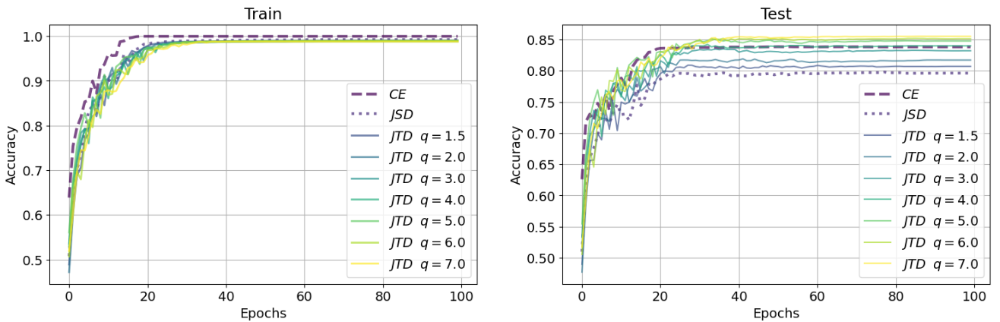

# Projects

Welcome to my portfolio of selected research and engineering projects. My work spans machine learning applications, deep learning optimization, time-series analysis, signal processing, and real-world diagnostics in high-voltage systems and mechanical components. Below you'll find detailed descriptions of my key contributions, including methodologies, visuals, and links to related publications.

---

## ⏱️ Multiscale Time-Series Feature Extraction Using Entropic & Informational Functionals

This project proposes a general-purpose methodology to transform time series into interpretable sequences of **entropic and information-theoretic features**. The method is designed for **anomaly detection** and **time-series characterization** in domains such as fault monitoring, EEG seizure detection, and more.

The approach combines:
- **Multiscale overlapping windows**
- **Non-parametric Kernel Density Estimation (KDE)**
- **Adaptive bandwidth optimization using Jensen–Shannon Divergence (JSD)**
- **A library of continuous entropic and informational measures** (e.g., Shannon, Tsallis, Rényi, Fisher Information)

---

### 🧠 Why This Matters

Entropy and information measures provide a **rich, continuous description of signal complexity**, uncertainty, and structure — essential for detecting subtle or time-localized anomalies. Our method optimizes the transformation parameters and builds a **scale-adaptive, windowed representation** of the signal.

---

### 📐 Method Overview

The methodology applies **KDE** to windowed segments of the time series at multiple scales, producing a sequence of PDFs. Then, various **entropy-based features** are computed for each PDF. The bandwidth is optimized offline using **JSD**, ensuring minimal bias and variance.

  
*A modular pipeline applying KDE, JSD-based optimization, and entropic feature extraction over multiscale overlapping windows.*

---

### 🔬 Experimental Results

#### 🧪 Synthetic Signal with Contextual Anomaly

We generate a synthetic signal that transitions from a normal to an anomalous regime using added frequency components. The anomaly is detected by shifts in entropy and information content.

  
*A designed synthetic signal where harmonic content shifts during the anomaly window.*

#### 🎯 Multiscale Feature Plots

We visualize the extracted features across different window sizes and time indices.

  
*Multiscale entropy and Fisher information curves over time. Anomalies manifest as sudden drops in information and spikes in entropy.*

---

### 🧠 Real Application: EEG Seizure Detection

The methodology was applied to **scalp EEG signals** from the CHB-MIT database. The results show that seizures trigger consistent, multi-scale changes in the extracted features.

  
*EEG signal before seizure: healthy baseline.*

  
*Entropy and information functionals capturing the seizure onset across scales.*

---

### 📈 Final Validation

To ensure interpretability, we also plotted the PDFs generated at different scales and bandwidths to visualize how KDE transforms signal windows before entropy evaluation.

  
*Grid of PDFs for anomaly and normal signals across scales and bandwidths, showing clear contrast.*

---

### 📄 Related Publication

**Squicciarini, A., Valero Toranzo, E., Zarzo, A.**  
*A Time-Series Feature-Extraction Methodology Based on Multiscale Overlapping Windows, Adaptive KDE, and Continuous Entropic and Information Functionals*,  
Mathematics, vol. 12, 2396, 2024.  
📎 [https://doi.org/10.3390/math12152396](https://doi.org/10.3390/math12152396)  
🔬 [Project Code on GitHub](https://github.com/antosquicciarini/Information_Measurement)

---

## 📉 Jensen-Tsallis Divergence for Supervised Classification under Data Imbalance

In many real-world classification problems—such as in healthcare, fraud detection, or predictive maintenance—data imbalance is a major challenge. Conventional loss functions like **Categorical Cross Entropy (CE)** can lead to models that overfit to majority classes and produce **overconfident predictions** that fail to generalize.

In this work, we propose the **Jensen-Tsallis Divergence (JTD)** as a **new loss function** for deep learning models trained on imbalanced datasets. It generalizes the well-known **Jensen-Shannon Divergence (JSD)** by incorporating **Tsallis entropy**, introducing a tunable parameter `q` that directly influences regularization strength.

---

### 🧠 Why Jensen-Tsallis?

- **Built-in regularization**: JTD discourages overconfident output distributions, leading to better generalization.
- **Tunable flexibility**: The `q` parameter controls how strongly the model penalizes high-confidence predictions.
- **Superior performance**: JTD consistently outperforms CE, JSD, and focal loss in tests with artificially imbalanced datasets (MNIST, CIFAR-10, SVHN, Fashion-MNIST).

---

### 🔍 Theoretical Insight

We demonstrate that JTD introduces an intrinsic **confidence penalty** on output predictions. By adjusting `q`, we control how conservative the model becomes, thus reducing overfitting.

---

### 🔬 Results: Accuracy & Regularization Effect

#### 🔄 Learning Curve Comparison

  
*Test vs train accuracy using CE, JSD, and JTD with various `q`. JTD improves generalization without overfitting.*

#### 🎯 Regularization Term Behavior

  
*Behavior of the JTD's regularization term as a function of model confidence. Larger `q` values shift the regularization curve and enhance robustness.*

---

### 📄 Related Preprint

**Squicciarini, A., Trigano, T., Luengo, D.**  
*Jensen-Tsallis Divergence for Supervised Classification under Data Imbalance*, submitted to Springer - Machine Learning (ECLM 2025).  
🔗 [Project Repository](https://github.com/antosquicciarini/Jensen_Tsallis_Divergence_for_Supervised_Classification_under_Data_Imbalance)

---

## 🔧 Rub Detection in Aeroderivative Gas Turbines

**Rotor–stator rub** is a common but critical malfunction in turbomachinery, particularly in aero-derivative gas turbines where design constraints limit sensor placement. Due to compact geometries and the use of ball bearings instead of hydrodynamic ones, **proximity sensors are impractical**, and vibration must be monitored indirectly via **accelerometers on the casing**.

These signals are affected by high levels of noise, making **rub detection in early stages difficult** with traditional frequency-domain techniques such as Fourier analysis.

---

### 🧠 Our Deep Learning-Based Solution

In our work, we present a novel **Intelligent Fault Detection (IFD)** system using **deep neural networks (DNNs)** trained with **synthetic vibration data** from a calibrated **finite element (FE) model** of a rotating machine.

This data-driven approach avoids the need to collect dangerous real-world fault data and opens the door to safe, scalable training of deep models. The key features of our methodology include:

- **Synthetic Dataset Creation**: An FE model simulates rub events of varying intensity and frequency (e.g., light rub: 1×; heavy rub: ½×).
- **Transfer Learning**: The DNN trained on simulated data generalizes well to **real experimental signals**, achieving up to **91% G-Mean** and **~86% accuracy**.
- **Data Preprocessing**: Accelerometer signals are resampled, windowed, and transformed via **FFT** to emphasize relevant harmonic content.
- **Regularization & Optimization**: Grid search was used to identify optimal architectures with **L1/L2 regularization**, improving generalization.

---

### 🖼️ Simulation and Experimental Setup

#### 🧩 Finite Element Model Simulation
Here are two visualizations from the FE model used to generate synthetic training data for rub scenarios:

  
*Finite Element model simulating single-point rub in high-speed shaft.*

  
*FE mesh used to simulate both light and heavy rub events.*

#### 🧪 Real Experimental Setup

  
*Experimental test bench with mounted accelerometers and proximity sensors used to validate model predictions.*

---

### 📊 Results and Transfer Learning Performance

We tested multiple DNN architectures with different regularization techniques (L1, L2, ElasticNet) to study how they affect generalization from synthetic to real-world signals.

#### 📋 Result Summary

  
*Performance of different DNN models on real test signals after training on synthetic data.*

#### 📈 AUC/ROC Curves Comparison

  
*Comparison of AUC-ROC performance across models with varying regularization. Shows impact of regularization on robustness and transfer learning accuracy.*

---

### 📄 Related Publication

**Squicciarini, A., Zarzo, A., González-Guillén, C.E., Muñoz-Guijosa, J.M.**  
*Application of Deep Neural Networks for Automatic Rub Detection in Aero-Derivative Gas Turbines*,  
Advanced Engineering Informatics, vol. 62, 2024, Art. no. 102607.  
📎 [DOI: 10.1016/j.aei.2024.102607](https://doi.org/10.1016/j.aei.2024.102607)

---

## ⚡ Partial Discharge Detection

**Partial discharges (PD)** are localized electrical discharges that occur within insulation systems of high-voltage equipment, without completely bridging the electrodes. These discharges are early indicators of insulation degradation and can lead to failure if not identified and managed early.

PD detection is essential in **AC systems**, but with the growing development of **high-voltage DC (HVDC) transmission**, their identification in **DC environments** is becoming increasingly critical. HVDC is playing a pivotal role in long-distance power transmission and renewable energy integration, making PD monitoring under DC stress fundamental for system reliability.

---

### 🧬 Types of Partial Discharges

Partial discharges can manifest in different forms, depending on the location and mechanism of the discharge. Understanding these types helps in better diagnosis and classification:

- **Corona Discharge**: Occurs in gaseous media, typically around sharp edges or points where the electric field is highly concentrated. It is often accompanied by audible noise and ozone production.
- **Void Discharge**: Takes place within internal air-filled voids in solid insulating materials. These are dangerous over time as they can erode the insulation from the inside.
- **Surface (Superficial) Discharge**: Happens along the surface of insulating materials, especially in contaminated or moist environments. It can lead to tracking and eventual breakdown.
- **Floating Potential Discharge**: Arises from conductive elements embedded in the insulation that are not at a fixed electrical potential. These can oscillate and trigger discharges as the electric field fluctuates.

---

### ❓ Why Classifying PD Types Matters

Correctly **identifying the type of partial discharge** is crucial because each type is associated with different failure mechanisms, risk levels, and preventive actions:

- **Diagnostic Insight**: Each PD type reveals specific faults—voids suggest material degradation, while surface discharges may indicate environmental contamination.
- **Targeted Maintenance**: Accurate classification enables **predictive maintenance**, reducing downtime and extending equipment lifespan.
- **Risk Assessment**: Some PD types, like void discharges, may escalate more rapidly into full breakdowns than others like corona. Recognizing this allows for **prioritization of interventions**.
- **Data-Driven Design**: Understanding the most common PD types in specific environments helps engineers design more **robust insulation systems**.

In short, classification is not just a labeling exercise — it’s a **strategic tool** for electrical asset management and grid resilience.

---

### 🧪 Our Project

In our project, we tackled the challenge of PD classification in DC systems by leveraging deep learning techniques with an emphasis on data representation and interpretability.

#### 📊 1. Preprocessing Inspired by PRPD Maps

We developed a data preprocessing technique inspired by **Phase-Resolved Partial Discharge (PRPD)** representations. Although PRPD maps are traditionally used in AC systems, we adapted them for input into **Convolutional Neural Networks (CNNs)**, enabling the use of computer vision methods for PD classification.

> 📌 *Note: The PRPD-based approach for AC PD classification is currently under development.*

#### 🧩 2. Data Augmentation for Phase Robustness

To increase robustness against shifts in the discharge phase and enhance generalization, we implemented a **data augmentation strategy** that simulates phase variation. This ensures that the model does not overfit to specific phase alignments.

#### 🧠 3. Model Interpretability with Integrated Gradients

We used **Integrated Gradients**, a method for explainable AI (XAI), to visualize the contributions of each input feature to the CNN's decision. This allowed us to evaluate the effectiveness of our preprocessing and identify areas for improvement.

---

### 🔁 Classification Flowchart for PD in DC Systems

Finally, we designed a full classification pipeline tailored to partial discharges under DC stress. The system incorporates signal acquisition, preprocessing, CNN-based classification, and interpretability feedback.

> 📝 *The results of this work applied to HVDC PD classification are published in:*  
> **[1]** C. Vera et al., “Validation of a Qualification Procedure Applied to the Verification of Partial Discharge Analysers Used for HVDC or HVAC Networks,” *Applied Sciences*, vol. 13, no. 14, Art. no. 8214, 2023.  
> [https://doi.org/10.3390/app13148214](https://doi.org/10.3390/app13148214)

---

### 📚 References

1. IEC 60270 – High-voltage test techniques – Partial discharge measurements.  
2. M. Cavallini & G.C. Montanari, *IEEE Trans. Dielectrics and Electrical Insulation*, 2005.  
3. R. Albarracín et al., *IEEE Electrical Insulation Magazine*, 2019.  
4. M. Sundararajan et al., “Axiomatic Attribution for Deep Networks,” *ICML 2017*.  
5. C. Vera et al., *Applied Sciences*, vol. 13, no. 14, 2023. [DOI](https://doi.org/10.3390/app13148214)

---

[🔙 Back to Home](./)
