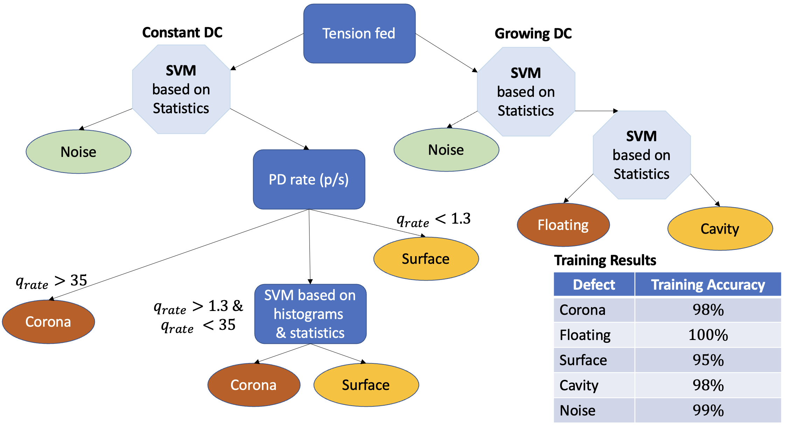

# Projects

## ⚡ Partial Discharge Detection

**Partial discharges (PD)** are localized electrical discharges that occur within insulation systems of high-voltage equipment, without completely bridging the electrodes. These discharges are early indicators of insulation degradation and can lead to failure if not identified and managed early.

PD detection is essential in **AC systems**, but with the growing development of **high-voltage DC (HVDC) transmission**, their identification in **DC environments** is becoming increasingly critical. HVDC is playing a pivotal role in long-distance power transmission and renewable energy integration, making PD monitoring under DC stress fundamental for system reliability.

---

### 🧪 Our Project

In our project, we tackled the challenge of PD classification in DC systems by leveraging deep learning techniques with an emphasis on data representation and interpretability.

#### 📊 1. Preprocessing Inspired by PRPD Maps

We developed a data preprocessing technique inspired by **Phase-Resolved Partial Discharge (PRPD)** representations. Although PRPD maps are traditionally used in AC systems, we adapted them for input into **Convolutional Neural Networks (CNNs)**, enabling the use of computer vision methods for PD classification.

#### 🧩 2. Data Augmentation for Phase Robustness

To increase robustness against shifts in the discharge phase and enhance generalization, we implemented a **data augmentation strategy** that simulates phase variation. This ensures that the model does not overfit to specific phase alignments.

#### 🧠 3. Model Interpretability with Integrated Gradients

We used **Integrated Gradients**, a method for explainable AI (XAI), to visualize the contributions of each input feature to the CNN's decision. This allowed us to evaluate the effectiveness of our preprocessing and identify areas for improvement.

---

### 🔁 Classification Flowchart for PD in DC Systems

Finally, we designed a full classification pipeline tailored to partial discharges under DC stress. The system incorporates signal acquisition, preprocessing, CNN-based classification, and interpretability feedback.

---

### 📚 References

1. IEC 60270 – High-voltage test techniques – Partial discharge measurements.  
2. M. Cavallini & G.C. Montanari, *IEEE Trans. Dielectrics and Electrical Insulation*, 2005.  
3. R. Albarracín et al., *IEEE Electrical Insulation Magazine*, 2019.  
4. M. Sundararajan et al., “Axiomatic Attribution for Deep Networks,” *ICML 2017*.

---

## 🔬 Research Experience

**SIAM MDS22** — Poster: *Training Neural Networks with Synthetic Data* (USA, 2022)  
**CIBIM2022** — Paper: *Rub Detection in Gas Turbines with Deep Learning* (Madrid, 2022)  
**CEM Workshop** — Poster: *Validation of Calibration Procedures for HVDC PD Analyzers* (2023)  
**FDA & Nonparametric Stats Workshop** — Seminar: *EEG Seizure Analysis with KDE & Info Metrics*  
**IX Iberian Modelling Week** — Project: *Cryoablation Tumor Segmentation Algorithm*  
**BYMAD Conference** — Presentation: *EEG Seizure Description via Entropic Metrics*  
**III Junior Interdisciplinary Workshop** — Talk: *Time Signal Anomaly Detection Using KDE*

---

## 📚 Publications

- *Application of Deep Neural Networks for Automatic Rub Detection in Gas Turbines*  
  _Advanced Engineering Informatics_ (2024)

- *Validation of a Qualification Procedure for PD Analyzers*  
  _Applied Sciences_ (2023)

- *Jensen-Tsallis Divergence for Supervised Classification under Data Imbalance*  
  _(Submitted – NeurIPS 2024)_

- *Feature Extraction in Time Series with KDE & Entropic Functionals*  
  _(Under Review – MDPI Mathematics, 2024)_

---

## 💼 Work Experience

**Postgraduate Researcher**  
Universidad Politécnica de Madrid (2020 – 2022)  
- Developed supervised algorithms for partial discharge classification in HV networks.

---

## 🛠 University Projects

- **ERASMUS+ Programme**, UPM (2019–2020)  
- **PoliTo Sailing Team**, Dynamic Division (2018–2019)  
- **SEI - Explorer Module**, Fondazione Agnelli (2018)  
- **Percorso per Giovani Talenti**, Politecnico di Torino (2015–2018)

---

[🔙 Back to Home](./)
